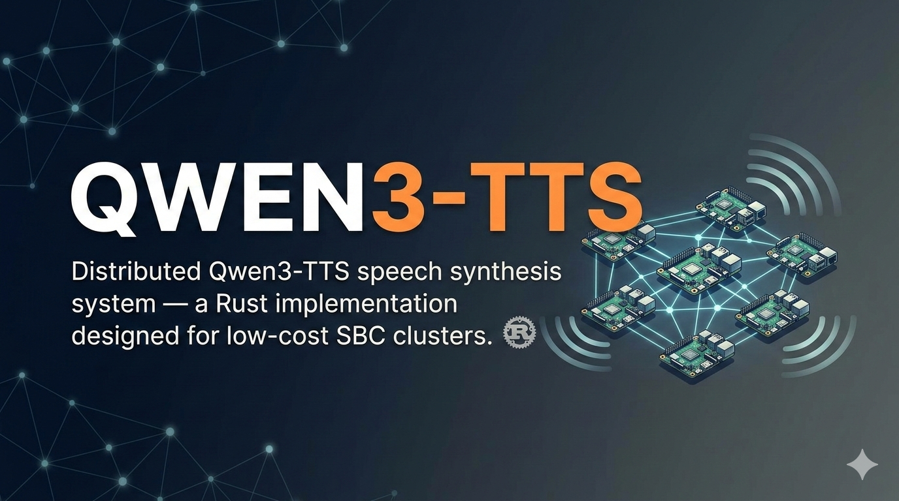
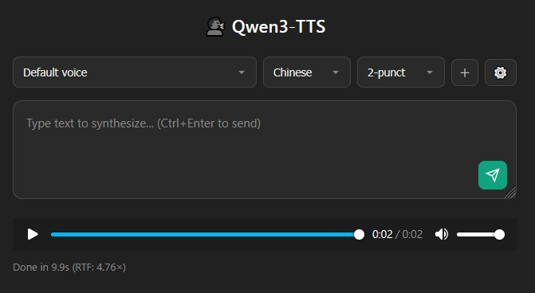

<div align="center">



# qwen3-tts

Distributed Qwen3-TTS — Rust-based distributed text-to-speech optimized for low-cost SBC clusters.

We have a Web UI now! Start the server and open the built-in web interface in your browser.

Single binary provides CLI, an OpenAI-compatible HTTP API (with web UI), an MCP stdio bridge, and inference workers. Models auto-download from HuggingFace Hub.


[![][license-shield]][license-shield-link]
[![][last-commit-shield]][last-commit-shield-link]


[中文文檔](README-zh.md)

We have WebUI Now!



</div>

## Easy Install (systemd --user)

Run these on the corresponding machines:

```bash
# Main node: Talker worker
curl -fsSL https://github.com/darkautism/qwen3-tts/raw/refs/heads/master/deploy/systemd/install-talker.sh | bash

# Compute node: Predictor worker (default q4)
curl -fsSL https://github.com/darkautism/qwen3-tts/raw/refs/heads/master/deploy/systemd/install-predictor.sh | bash

# Compute node: Vocoder worker (ONNX FP32, no RKNN noise)
curl -fsSL https://github.com/darkautism/qwen3-tts/raw/refs/heads/master/deploy/systemd/install-vocoder.sh | bash

# Main node: Frontend (OpenAI API + Web UI)
curl -fsSL https://github.com/darkautism/qwen3-tts/raw/refs/heads/master/deploy/systemd/install-frontend.sh | bash
```

Each script will:
1. Install `qwen3-tts-rs` from GitHub to `~/.cargo/bin` (`cargo install --git https://github.com/darkautism/qwen3-tts --locked --root "$HOME/.cargo" qwen3-tts-rs`) if `~/.cargo/bin/qwen3-tts` is missing.
2. Download the corresponding unit file from GitHub raw path to `~/.config/systemd/user/`.
3. Reload and enable the user service.
4. Attempt `loginctl enable-linger $USER` so user services survive reboot.

Config note:
- Frontend reads `~/.config/qwen3-tts/config.toml` under `systemctl --user`.
- If missing, generate it with:
  `qwen3-tts init --talker-ip <IP1> --predictor-ip <IP2> --vocoder-ip <IP2>`.

## Architecture

```
 Machine 1 (SBC / Server)              Machine 2 (SBC / Server)
┌──────────────────────────┐          ┌──────────────────────────┐
│  qwen3-tts (Rust)        │          │  Worker: Predictor       │
│  ├── CLI / API / MCP     │   TCP    │  ├── CodePredictor       │
│  └── Orchestrator        │◄───────►│  │   (Candle Q8, CPU)    │
├──────────────────────────┤          │  │              :9091    │
│  Worker: Talker    :9090 │          ├──────────────────────────┤
│  ├── Tokenizer (HF)      │          │  Worker: Vocoder         │
│  ├── TextEmbedder (npy)  │          │  └── Vocoder             │
│  └── Talker LLM          │          │      (ONNX, CPU)  :9092 │
│      (Candle GGUF, CPU)  │          └──────────────────────────┘
└──────────────────────────┘
```

**Three Worker Roles:**

| Worker | Function | Compute | Default Port |
|--------|----------|---------|--------------|
| **Talker** | Tokenizer + TextEmbedder + LLM | CPU | 9090 |
| **Predictor** | CodePredictor (Candle GGUF, default) + ONNX fallback + feedback embedding | CPU | 9091 |
| **Vocoder** | Vocoder (ONNX FP32 CPU) | CPU | 9092 |

Distributes workload across low-cost SBCs or any Linux machines. Token generation: ~5.5 tok/s with stripped code-predictor GGUF (default).
Predictor backend default is GGUF (Candle/GGML path); ONNX is fallback/diagnostic only.

## Requirements

### Hardware
- 1–3 Linux machines (low-cost ARM SBCs work well; 4GB+ RAM per node)
- Any aarch64 or x86_64 Linux system — tested on RK3588, should work on other ARM boards

### Runtime Dependencies

Inference core (Talker, Predictor) uses Candle (pure Rust) — **no external libraries needed**.

**Vocoder machine requires:**

| Library | Source | Install Path |
|---------|--------|-------------|
| `libonnxruntime.so` | `uv pip install onnxruntime` or `uv pip install onnxruntime-gpu` | System path or `ORT_DYLIB_PATH` |

### Installing ONNX Runtime (Vocoder Machine)

```bash
# CPU (uv)
uv pip install onnxruntime

# CUDA (uv, GPU build)
uv pip install onnxruntime-gpu

# uvx alternative
uvx pip install onnxruntime
uvx pip install onnxruntime-gpu

# If the library isn't on your system path, set ORT_DYLIB_PATH
export ORT_DYLIB_PATH=/path/to/libonnxruntime.so
```

> With `--features onnx-cuda`, install **both** CUDA Toolkit and cuDNN, otherwise CUDA EP initialization will fail.

#### Manual package from ONNX Runtime v1.24.2

Download from:
`https://github.com/microsoft/onnxruntime/releases/tag/v1.24.2`

After extracting, point `ORT_DYLIB_PATH` to the runtime library:
- **Linux x64 GPU**: `.../onnxruntime-linux-x64-gpu-1.24.2/lib/libonnxruntime.so`
- **Linux aarch64 CPU**: `.../onnxruntime-linux-aarch64-1.24.2/lib/libonnxruntime.so`

You can also place `libonnxruntime.so` in a standard library search path.

### (Optional) RKNN NPU Acceleration

With `--features rknn-vocoder`, the vocoder runs on Rockchip NPU instead of CPU.
**Note:** RKNN INT8 quantization introduces audible noise in the output. Use only if RTF reduction is critical.

```bash
# Requires librknnrt.so and RKNPU kernel driver
sudo curl -L https://github.com/airockchip/rknn-toolkit2/raw/refs/heads/master/rknpu2/runtime/Linux/librknn_api/aarch64/librknnrt.so \
  -o /lib/librknnrt.so
```

## Building

```bash
# Standard build (Candle inference + ONNX FP32 vocoder — pure Rust, no extra .so)
cargo build --release

# CUDA ONNX (vocoder + ONNX predictor on GPU)
cargo build --release --features onnx-cuda

# RKNN INT8 vocoder (Rockchip NPU only — faster but introduces quantization noise)
cargo build --release --features rknn-vocoder
# Output: target/release/qwen3-tts (~15-20 MB)
```

> Cross-compile: `cross build --release --target aarch64-unknown-linux-gnu`

### Feature Gates

| Feature | Description | Extra Dependencies | Performance |
|---------|-------------|-------------------|-------------|
| (default) | Candle inference + ONNX vocoder | `libonnxruntime.so` | **~5.5 tok/s** |
| `onnx-cuda` | ONNX CUDA EP for vocoder (+ predictor ONNX fallback path) | `onnxruntime-gpu` + CUDA/cuDNN | GPU-dependent |
| `ggml-backend` | llama.cpp talker + GGML predictor | `llama_wrapper.so` + static GGML libs | Fastest on tuned ARM |
| `ggml-predictor` | GGML predictor only (talker stays Candle) | static GGML libs | Predictor-only acceleration |
| `rknn-vocoder` | RKNN INT8 vocoder (Rockchip NPU) | `librknnrt.so` + RKNPU kernel | ⚠️ has noise |

Default uses Candle (pure Rust) inference — no C/C++ library installation needed.
The Candle backend includes SDOT inline assembly optimization and benefits greatly from stripped GGUF models.
RKNN vocoder trades audio quality for speed — INT8 quantization introduces audible artifacts.
Predictor does **not** require ONNX and GGUF at the same time: it prefers GGUF (GGML/Candle), and only falls back to ONNX when GGUF is missing.

### Enable GGML Features from Source

`ggml-predictor` / `ggml-backend` require native C/C++ static libraries.  
`build.rs` now auto-initializes and auto-builds them from `third_party/qwen3-tts.cpp` (submodule), so `cargo install --git` can build GGML mode directly.

Requirements: `git`, `cmake`, C++ toolchain (`c++`), and `ar` (binutils).

1) Recommended: one-command install (auto submodule + auto native build):

```bash
# Predictor only (talker stays Candle)
cargo install --git "https://github.com/darkautism/qwen3-tts" \
  --locked qwen3-tts-rs \
  --features ggml-predictor

# Talker + predictor on GGML
cargo install --git "https://github.com/darkautism/qwen3-tts" \
  --locked qwen3-tts-rs \
  --features ggml-backend
```

`build.rs` will generate/check these artifacts automatically:

```text
$GGML_LIB_DIR/build/libcode_pred_ggml.a
$GGML_LIB_DIR/build/libtts_transformer.a
$GGML_LIB_DIR/ggml/build/src/libggml.a
$GGML_LIB_DIR/ggml/build/src/libggml-cpu.a
$GGML_LIB_DIR/ggml/build/src/libggml-base.a
```

2) Optional override: use your own `qwen3-tts.cpp` source tree:

```bash
export GGML_LIB_DIR="$HOME/qwen3_research/qwen3-tts.cpp"
git clone --recursive https://github.com/predict-woo/qwen3-tts.cpp "$GGML_LIB_DIR"

# build.rs will use GGML_LIB_DIR and build missing native libs
cargo build --release --features ggml-predictor
```

3) (Only for `ggml-backend`) Build `llama_wrapper.so` from `llama.cpp` source:

```bash
git clone https://github.com/ggml-org/llama.cpp "$HOME/llama.cpp"
cmake -S "$HOME/llama.cpp" -B "$HOME/llama.cpp/build" -DBUILD_SHARED_LIBS=ON -DCMAKE_BUILD_TYPE=Release
cmake --build "$HOME/llama.cpp/build" -j

cd /path/to/qwen3-tts
gcc -shared -fPIC -O3 scripts/llama_wrapper.c \
  -I"$HOME/llama.cpp/include" \
  -I"$HOME/llama.cpp/ggml/include" \
  -L"$HOME/llama.cpp/build/bin" \
  -lllama -lggml -lggml-base -lggml-cpu \
  -Wl,-rpath,"$HOME/llama.cpp/build/bin" \
  -o llama_wrapper.so
sudo install -m 0755 llama_wrapper.so /usr/lib/llama_wrapper.so
```

4) Runtime check:

```bash
qwen3-tts worker -r predictor -b 0.0.0.0:9091 --quant q4
# Expect log: "Using GGML code predictor (optimized C backend)"
```

## Quick Start

### Initialize Configuration

```bash
# Generate ~/.config/qwen3-tts/config.toml with your worker IPs
qwen3-tts init --talker-ip <IP1> --predictor-ip <IP2> --vocoder-ip <IP2>
```

### Start Workers (models auto-download from HF Hub)

```bash
# IP1 - Talker Worker (big-core pinning is automatic on RK3588)
qwen3-tts worker -r talker -b 0.0.0.0:9090

# IP2 - Predictor Worker (Q4 quantization for max speed)
qwen3-tts worker -r predictor -b 0.0.0.0:9091 --quant q4

# IP2 - Vocoder Worker (can share machine with Predictor)
qwen3-tts worker -r vocoder -b 0.0.0.0:9092
```

> qwen3-tts resolves role files from HuggingFace Hub cache paths (from `hf-hub` `repo.get(...)`).
> It only falls back to local `${XDG_DATA_HOME:-$HOME/.local/share}/qwen3-tts/models/{role}/` if Hub resolution fails and local files are complete.
> Custom HF repo: `--repo your-name/your-repo`
> For specific core pinning: `--cores 4-7` or `--cores 4,5,6,7`
> On big.LITTLE SoCs (RK3588), big-core pinning is enabled by default (no extra flag required).

### Synthesize Speech

```bash
# Simple usage (outputs output.wav)
qwen3-tts "你好世界"

# Specify output and language
qwen3-tts speak "Hello world" -o speech.wav --lang english

# Voice cloning (custom voice file)
qwen3-tts speak "你好" --voice my_voice.json -o clone.wav
```

> Default chunk mode is `none` (no text splitting). Use `--chunk 2` or `--chunk 4` only when you explicitly want punctuation-based chunking.

## Voice Cloning

### Creating a Voice Profile

Runs directly on ARM SBCs — **no x86 or Python needed**:

```bash
# Encode reference audio → outputs a single .json voice file (any sample rate, auto-resampled to 24kHz)
qwen3-tts encode-voice \
    -a reference.wav \
    -r "Text spoken in the reference audio" \
    -o my_voice.json

# Use the custom voice
qwen3-tts speak "New text to synthesize" --voice my_voice.json -o output.wav
```

Voice file format (`.json`):
```json
{
  "ref_text": "Text spoken in the reference audio",
  "codec_tokens": [[...], ...]
}
```

> Voice cloning now defaults to **ref_text ICL conditioning** when `ref_text` is provided in the voice JSON.
> If you want speaker-only conditioning instead, set `QWEN3_TTS_CLONE_MODE=speaker` on worker processes.
> Legacy `.npy` and `.pt` files are also supported.

Clone stability note:
- For `ref_text` ICL mode, talker should log  
  `Loaded 15 code predictor codec embeddings ... code_predictor_weights.npz`.
- If this line is missing, clone intelligibility may regress; check model layout and worker logs before benchmarking.

Voice encoding uses a native Candle (Rust ML) implementation of the Mimi Speech Tokenizer —
processes ~4s of audio in ~2s, entirely on CPU.

## Deployment Examples

### Single Machine (all three workers on IP1)

```bash
qwen3-tts init --talker-ip 127.0.0.1 --predictor-ip 127.0.0.1 --vocoder-ip 127.0.0.1
```

```bash
# Terminal 1: Talker
qwen3-tts worker -r talker -b 0.0.0.0:9090

# Terminal 2: Predictor
qwen3-tts worker -r predictor -b 0.0.0.0:9091

# Terminal 3: Vocoder
qwen3-tts worker -r vocoder -b 0.0.0.0:9092

# Terminal 4: Synthesize
qwen3-tts "你好世界"
```

```bash
qwen3-tts init --talker-ip 127.0.0.1 --predictor-ip <IP2> --vocoder-ip <IP2>
```

```bash
# IP1:
qwen3-tts worker -r talker -b 0.0.0.0:9090

# IP2:
qwen3-tts worker -r predictor -b 0.0.0.0:9091
qwen3-tts worker -r vocoder -b 0.0.0.0:9092

# IP1:
qwen3-tts "你好世界"
```

### Three Machines (IP1 = Talker, IP2 = Predictor, IP3 = Vocoder)

```bash
qwen3-tts init --talker-ip <IP1> --predictor-ip <IP2> --vocoder-ip <IP3>
```

```bash
# IP1:
qwen3-tts worker -r talker -b 0.0.0.0:9090

# IP2:
qwen3-tts worker -r predictor -b 0.0.0.0:9091

# IP3:
qwen3-tts worker -r vocoder -b 0.0.0.0:9092

# Any machine (including IP1):
qwen3-tts "你好世界"
```

### Using Deployed Workers from Any Machine

Any machine with the `qwen3-tts` binary and correct config can synthesize speech. The client needs no GPU, NPU, or special hardware.

```bash
cat > qwen3-tts.toml << EOF
[workers.talker]
host = "<IP1>"
port = 9090

[workers.predictor]
host = "<IP2>"
port = 9091

[workers.vocoder]
host = "<IP2>"
port = 9092

[defaults]
language = "chinese"
max_tokens = 200
temperature = 0.8
cp_temperature = 0.1
repetition_penalty = 1.2

[server]
host = "0.0.0.0"
port = 8080
EOF

qwen3-tts "你好世界"
```

## CLI Reference

| Command | Description |
|---------|-------------|
| `qwen3-tts "text"` | Quick speech synthesis (outputs output.wav) |
| `qwen3-tts speak "text" -o file.wav` | Specify output file |
| `qwen3-tts speak "text" --lang english` | Specify language |
| `qwen3-tts speak "text" --voice voice.json` | Voice cloning |
| `qwen3-tts speak "text" --chunk none` | No text split (default mode) |
| `qwen3-tts encode-voice -a ref.wav -r "text" -o voice.json` | Create voice profile (native ARM64) |
| `qwen3-tts serve --port 8080` | Start OpenAI-compatible API server |
| `qwen3-tts mcp` | Start MCP server (stdio) |
| `qwen3-tts worker -r talker` | Start Talker Worker (auto big-core pinning on RK3588) |
| `qwen3-tts worker -r predictor` | Start Predictor Worker |
| `qwen3-tts worker -r vocoder` | Start Vocoder Worker |
| `qwen3-tts worker -r talker --big-cores` | Legacy alias (now default behavior) |
| `qwen3-tts worker -r talker --cores 4-7` | Worker pinned to specific cores |
| `qwen3-tts init --predictor-ip <IP>` | Generate config file |

## OpenAI-Compatible API & Web UI

```bash
# Start server (includes built-in web UI at http://localhost:8080)
qwen3-tts serve --port 8080
```

### Web UI

Open `http://<server-ip>:8080` in a browser. The built-in web UI provides:

- **Text input** with Ctrl+Enter to synthesize
- **Voice selector** dropdown — populated from 500+ voices on [HuggingFace](https://huggingface.co/kautism/qwen3_tts_voices_json), grouped by game/character
- **Language selector** (Chinese, English, Japanese, Korean)
- **Chunk selector** (`none` default, optional `2` / `4`)
- **Audio playback** directly in browser

No installation required — pure HTML/JS, served by the same binary.

### REST API

```bash
# Basic synthesis
curl -X POST http://<IP1>:8080/v1/audio/speech \
  -H "Content-Type: application/json" \
  -d '{"input": "Hello world", "voice": "default"}' \
  --output speech.wav

# Voice cloning (voice = path to voice file, supports .json/.npy/.pt)
curl -X POST http://<IP1>:8080/v1/audio/speech \
  -H "Content-Type: application/json" \
  -d '{"input": "Hello world", "voice": "/path/to/my_voice.json"}' \
  --output speech.wav
```

Supported parameters:

| Parameter | Type | Default | Description |
|-----------|------|---------|-------------|
| `input` | string | (required) | Text to synthesize |
| `voice` | string | `"default"` | Voice file path (`.json`/`.npy`/`.pt`) |
| `language` | string | `"chinese"` | Language |
| `chunk_mode` | string | `"none"` | Text chunking mode (`none`, `2`, `4`) |
| `model` | string | `"qwen3-tts"` | Model name |
| `response_format` | string | `"wav"` | Output format |

## MCP Server

Provides AI tools via stdio JSON-RPC:

```bash
qwen3-tts mcp
```

### Tools

- **text_to_speech** — Text-to-speech with voice cloning support

### Configuration (Claude Desktop / Cursor etc.)

```json
{
  "mcpServers": {
    "qwen3-tts": {
      "command": "/path/to/qwen3-tts",
      "args": ["mcp"]
    }
  }
}
```

### Example Call

```json
{
  "jsonrpc": "2.0",
  "id": 1,
  "method": "tools/call",
  "params": {
    "name": "text_to_speech",
    "arguments": {
      "text": "Hello, this is a voice cloning test.",
      "voice": "/path/to/my_voice.json",
      "output_path": "output.wav"
    }
  }
}
```

## Configuration

Path priority: `./qwen3-tts.toml` > `~/.config/qwen3-tts/config.toml`

```toml
[workers.talker]
host = "127.0.0.1"       # Talker Worker IP
port = 9090

[workers.predictor]
host = "<YOUR_IP>"        # ⚠️ Change to your Predictor IP
port = 9091

[workers.vocoder]
host = "<YOUR_IP>"        # ⚠️ Change to your Vocoder IP
port = 9092

[defaults]
language = "chinese"
max_tokens = 200
temperature = 0.8
cp_temperature = 0.1
repetition_penalty = 1.2

# EOS convergence parameters (tunable, defaults work for most cases)
# eos_start_ratio = 0.6     # Start boosting EOS at 60% of estimated tokens
# eos_max_ratio = 1.2       # Max boost at 120%
# eos_force_ratio = 1.5     # Force stop at 150%
# eos_max_boost = 25.0      # Maximum EOS logit increment

[server]
host = "0.0.0.0"
port = 8080
```

## HuggingFace Model Structure

```
kautism/qwen3-tts-rk3588/
├── talker/                        # Talker Worker
│   ├── talker-q8_0.gguf          (768 MB, Q8 LLM)
│   ├── tokenizer.json            (11 MB)
│   └── embeddings/               (~1.2 GB)
├── predictor/                     # Predictor Worker
│   ├── code_predictor/
│   │   ├── code-predictor-q8_0.gguf  (206 MB, stripped — default download)
│   │   ├── code-predictor-q4_0.gguf  (169 MB, stripped Q4 — use --quant q4)
│   │   └── qwen3-tts-0.6b-q8_0.gguf (1.3 GB, full model — not recommended)
│   └── embeddings/
├── vocoder/                       # Vocoder Worker
│   ├── vocoder.onnx              (436 MB, FP32 CPU — default)
│   └── vocoder.rknn              (128 MB, INT8 NPU — needs rknn-vocoder feature)
└── speech_tokenizer/              # Voice encoding (encode-voice)
    └── model.safetensors         (651 MB, Mimi encoder)
```

Workers auto-download their role's models from HuggingFace Hub on first start.
Pass `--quant q4` to predictor workers to download/use only the Q4 predictor GGUF (169MB, ~16% faster).

## Supported Languages

Chinese · English · Deutsch · Русский · Français · 日本語 · 한국어

## Speed Optimization Guide

To achieve the best RTF on ARM SBCs, apply these optimizations (in order of impact):

### 1. Automatic big-core pinning (default on big.LITTLE SoCs)

```bash
# Default now auto-pins to performance cores (e.g., A76 on RK3588)
qwen3-tts worker -r predictor -b 0.0.0.0:9091
```

Without big-core pinning, rayon may distribute matmul work to slow efficiency cores → **~43% slower**.

### 2. Use Q4 quantization (`--quant q4`)

```bash
# Q4 model is 169MB vs 206MB for Q8. 16% faster prediction, comparable quality.
qwen3-tts worker -r predictor -b 0.0.0.0:9091 --quant q4
```

The Q4 GGUF is auto-downloaded from HuggingFace Hub when `--quant q4` is specified.

### 3. Distribute workers across machines

```bash
# Machine 1: talker only (gets all 4 big cores to itself)
qwen3-tts worker -r talker -b 0.0.0.0:9090

# Machine 2: predictor + vocoder (their own 4 big cores)
qwen3-tts worker -r predictor -b 0.0.0.0:9091 --quant q4
qwen3-tts worker -r vocoder -b 0.0.0.0:9092
```

Edit `qwen3-tts.toml` to point to remote workers:
```toml
[workers.talker]
host = "192.168.1.10"   # Machine 1
port = 9090

[workers.predictor]
host = "192.168.1.11"   # Machine 2
port = 9091

[workers.vocoder]
host = "192.168.1.11"   # Machine 2
port = 9092
```

This eliminates core contention and gives ~10% RTF improvement.

### 4. Build with SDOT (ARM dotprod)

```bash
# Enable ARM SDOT instruction for faster quantized matmul
RUSTFLAGS='-C target-feature=+dotprod' cargo build --release
```

This is critical on Cortex-A76 and newer cores. Without it, quantized inference uses a slower vmull+vpaddl path.

### Summary: Cumulative Effect

| What | MEDIUM RTF | Speedup |
|------|-----------|---------|
| Default (no optimization) | 4.96× | baseline |
| + auto big-core pinning + Q4 + SDOT | 2.87× | **42% faster** |
| + distribute to 2 machines | **2.61×** | **47% faster** |

## Performance

Tested on RK3588 (4×A76 + 4×A55), workers started with auto big-core pinning + `--quant q4`:

### Single Machine vs Two Machines

| Test | 1× RK3588 | 2× RK3588 (LAN) | Improvement |
|------|-----------|------------------|-------------|
| SHORT (~40 tokens) | 3.30× | **2.99×** | 9% |
| MEDIUM (~175 tokens) | 2.87× | **2.61×** | 9% |
| LONG (200 tokens) | 3.31× | **2.99×** | 10% |

The second machine offloads predictor + vocoder, freeing all 4 A76 cores on machine 1 for the talker.
Single-machine works well for simple deployments; adding a second board reduces RTF by ~10%.

| Metric | 1 Machine | 2 Machines |
|--------|-----------|------------|
| Token rate | ~4.9 tok/s | **~5.5 tok/s** |
| Talker latency | ~35ms/step | ~35ms/step |
| Predictor latency | ~93ms/step | ~93ms/step |
| Vocoder (ONNX FP32) | ~4.5s/batch | ~4.5s/batch |
| Vocoder (RKNN INT8) | ~2.7s/batch (⚠️ has noise) | ~2.7s/batch |
| **Best MEDIUM RTF** | 2.87× | **2.61×** |
| External dependencies | `libonnxruntime.so` only | same |

> RTF = generation time / audio duration. Lower is better; RTF < 1 is real-time.
>
> **Important:** On big.LITTLE SoCs (e.g., RK3588), big-core pinning is now enabled by default.
> If you need manual override, use `--cores`; otherwise predictor may degrade from 93ms to ~190ms on A55 cores.

### Optimization Journey

| Optimization | Predictor (ms/step) | MEDIUM RTF | Change |
|---|---|---|---|
| Baseline (Candle Q8_0, full 1.3GB GGUF) | 185 | 4.96× | — |
| + Server-side past_tokens + mem::take() | 185 | 4.79× | −3% |
| + **Stripped code-predictor GGUF (206MB)** | **108** | **3.12×** | **−37%** |
| + **CPU affinity (auto big-core pinning)** | **108** | **3.08×** | **−1%** |
| + Q4_0 quantization (`--quant q4`) | 93 | ~2.80× | −3% |
| + **Typed wire protocol** (ResponseData enum) | 93 | **2.58×** | **−8%** |

Key insight: the full 1.3GB GGUF contains talker weights (1075MB) never used by the predictor.
Stripping to a 206MB code-predictor-only GGUF eliminates L2 cache pollution → **41% faster prediction**.

The `scripts/extract_code_predictor_gguf.py` tool creates stripped GGUFs from full models.

> **Q4 vs Q8:** Q4 gives ~16% faster prediction (93ms vs 107ms) with comparable quality.
> Use `--quant q4` on the predictor worker for speed, `--quant q8` (default) for safety.

## Support the Project

If this project has saved you time or helped you in your workflow, consider supporting its continued development.

[![][ko-fi-shield]][ko-fi-link]
[![][paypal-shield]][paypal-link]

<!-- Link Definitions -->

[license-shield]: https://img.shields.io/badge/license-MIT-white?labelColor=black&style=flat-square
[license-shield-link]: https://github.com/darkautism/qwen3-tts/blob/main/LICENSE
[last-commit-shield]: https://img.shields.io/github/last-commit/darkautism/qwen3-tts?color=c4f042&labelColor=black&style=flat-square
[last-commit-shield-link]: https://github.com/darkautism/qwen3-tts/commits/main
[ko-fi-shield]: https://img.shields.io/badge/Ko--fi-F16061?style=for-the-badge&logo=ko-fi&logoColor=white
[ko-fi-link]: https://ko-fi.com/kautism
[paypal-shield]: https://img.shields.io/badge/PayPal-00457C?style=for-the-badge&logo=paypal&logoColor=white
[paypal-link]: https://paypal.me/kautism
